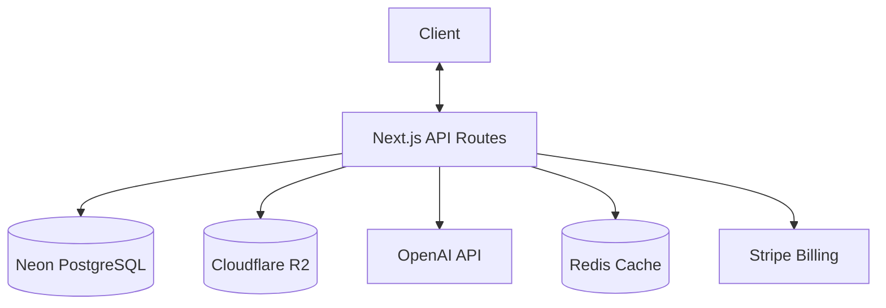
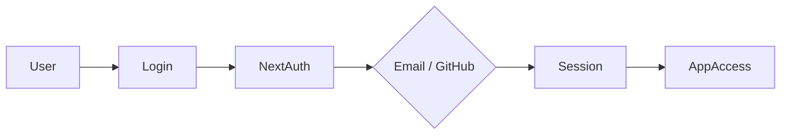
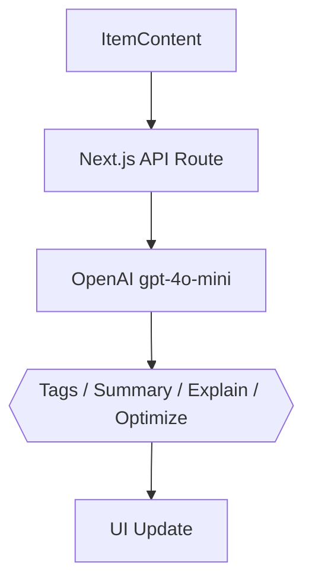

# 🗃️ DevStash — Project Overview

> **Store Smarter. Build Faster.**
> A centralized, AI-enhanced knowledge hub for developers.

---

## 📌 The Problem

Developers scatter their essential resources across too many places:

| Where it lives         | What's stored there |
| ---------------------- | ------------------- |
| VS Code / Notion       | Code snippets       |
| Chat history           | AI prompts          |
| Buried project folders | Context files       |
| Browser bookmarks      | Useful links        |
| Random folders         | Docs & references   |
| `.txt` files           | Commands & notes    |
| GitHub Gists           | Project templates   |
| Bash history           | Terminal commands   |

This creates **context switching**, **lost knowledge**, and **inconsistent workflows**.

➡️ **DevStash is ONE searchable, AI-enhanced hub for all your dev knowledge.**

---

## 🧑‍💻 Target Users

| Persona                       | Core Needs                                |
| ----------------------------- | ----------------------------------------- |
| 🧑‍💻 Everyday Developer         | Quick access to snippets, commands, links |
| 🤖 AI-First Developer         | Store prompts, workflows, context files   |
| 🎓 Content Creator / Educator | Save course notes, reusable code          |
| 🏗️ Full-Stack Builder         | Patterns, boilerplates, API references    |

---

## ✨ Core Features

### A) Item Types

Items belong to one of the following built-in system types:

| Icon  | Type        | Description                |
| ----- | ----------- | -------------------------- |
| `</>` | **Snippet** | Reusable code fragments    |
| 🤖    | **Prompt**  | AI prompts and workflows   |
| 📝    | **Note**    | Markdown notes and docs    |
| `$_`  | **Command** | CLI / terminal commands    |
| 📄    | **File**    | Uploaded files & templates |
| 🖼️    | **Image**   | Screenshots, diagrams      |
| 🔗    | **URL**     | Bookmarks and references   |

> 🔒 **Pro users** can define custom item types.

---

### B) Collections

Group mixed item types into named collections:

- `React Patterns`
- `Context Files`
- `Python Snippets`
- `Deployment Runbooks`

---

### C) Search

Full-text search across all content fields:

- Item content
- Tags
- Titles
- Item types

---

### D) Authentication

- 📧 Email + Password
- 🐙 GitHub OAuth (via NextAuth v5)

---

### E) Additional Features

- ⭐ Favorites & pinned items
- 🕐 Recently used
- 📥 Import from files
- ✍️ Markdown editor for text items
- 📤 File uploads (images, docs, templates)
- 📦 Export (JSON / ZIP)
- 🌙 Dark mode (default)

---

### F) AI Superpowers

> Powered by **OpenAI `gpt-4o-mini`**

| Feature                | Description                              |
| ---------------------- | ---------------------------------------- |
| 🏷️ Auto-tagging        | Automatically suggests relevant tags     |
| 📋 AI Summaries        | Generates short descriptions for items   |
| 🔍 Explain Code        | Natural-language explanation of snippets |
| ✨ Prompt Optimization | Rewrites prompts for better results      |

> 💡 AI features are **Pro-only**.

---

## 💰 Pricing

| Plan        | Price           | Item Limit | Collections | AI  | File Uploads | Custom Types | Export |
| ----------- | --------------- | ---------- | ----------- | --- | ------------ | ------------ | ------ |
| 🆓 **Free** | $0              | 50 items   | 3           | ❌  | Images only  | ❌           | ❌     |
| ⚡ **Pro**  | $8/mo or $72/yr | Unlimited  | Unlimited   | ✅  | All types    | ✅           | ✅     |

> 💳 Billing via **Stripe** — subscriptions + webhooks for plan sync.

---

## 🧱 Tech Stack

| Category     | Choice                          | Notes                         |
| ------------ | ------------------------------- | ----------------------------- |
| Framework    | **Next.js (React 19)**          | App Router                    |
| Language     | **TypeScript**                  | Strict mode                   |
| Database     | **Neon PostgreSQL**             | Serverless Postgres           |
| ORM          | **Prisma**                      | Type-safe queries             |
| Caching      | **Redis**                       | Optional, session/query cache |
| File Storage | **Cloudflare R2**               | S3-compatible object storage  |
| CSS / UI     | **Tailwind CSS v4 + shadcn/ui** | Dark mode first               |
| Auth         | **NextAuth v5**                 | Email + GitHub OAuth          |
| AI           | **OpenAI gpt-4o-mini**          | Tags, summaries, explain      |
| Payments     | **Stripe**                      | Subscriptions + webhooks      |
| Deployment   | **Vercel**                      | Edge-ready                    |
| Monitoring   | **Sentry**                      | Error tracking (post-MVP)     |

---

## 🗄️ Data Model

> ⚠️ **Rough draft** — this schema will evolve as the project develops.

```prisma
model User {
  id                   String       @id @default(cuid())
  email                String       @unique
  password             String?
  isPro                Boolean      @default(false)
  stripeCustomerId     String?
  stripeSubscriptionId String?
  items                Item[]
  itemTypes            ItemType[]
  collections          Collection[]
  tags                 Tag[]
  createdAt            DateTime     @default(now())
  updatedAt            DateTime     @updatedAt
}

model Item {
  id           String      @id @default(cuid())
  title        String
  contentType  String      // "text" | "file"
  content      String?     // used for text-based types
  fileUrl      String?
  fileName     String?
  fileSize     Int?
  url          String?
  description  String?
  isFavorite   Boolean     @default(false)
  isPinned     Boolean     @default(false)
  language     String?     // e.g. "typescript", "python"

  userId       String
  user         User        @relation(fields: [userId], references: [id])

  typeId       String
  type         ItemType    @relation(fields: [typeId], references: [id])

  collectionId String?
  collection   Collection? @relation(fields: [collectionId], references: [id])

  tags         ItemTag[]

  createdAt    DateTime    @default(now())
  updatedAt    DateTime    @updatedAt
}

model ItemType {
  id       String  @id @default(cuid())
  name     String
  icon     String?
  color    String?
  isSystem Boolean @default(false) // true = built-in, false = user-created (Pro)

  userId   String?
  user     User?   @relation(fields: [userId], references: [id])

  items    Item[]
}

model Collection {
  id          String   @id @default(cuid())
  name        String
  description String?
  isFavorite  Boolean  @default(false)

  userId      String
  user        User     @relation(fields: [userId], references: [id])

  items       Item[]
  createdAt   DateTime @default(now())
  updatedAt   DateTime @updatedAt
}

model Tag {
  id     String    @id @default(cuid())
  name   String
  userId String
  user   User      @relation(fields: [userId], references: [id])
  items  ItemTag[]
}

model ItemTag {
  itemId String
  tagId  String

  item Item @relation(fields: [itemId], references: [id])
  tag  Tag  @relation(fields: [tagId], references: [id])

  @@id([itemId, tagId])
}
```

---

## 🔌 API Architecture



---

## 🔐 Auth Flow



---

## 🧠 AI Feature Flow



---

## 🎨 UI / UX

- 🌙 **Dark mode first** — developer-friendly aesthetic
- Inspired by **[Notion](https://notion.so)**, **[Linear](https://linear.app)**, **[Raycast](https://raycast.com)**
- Syntax highlighting for all code snippets
- Minimal, distraction-free workspace

### Screenshots

Refer to the screenshots below as a base for the dashboard UI. It does not have to be exact. Use it as a reference:

- @context/screenshots/dashboard-ui-main.png
- @context/screenshots/dashboard-ui-drawer.png

### Layout

- **Collapsible sidebar** — filters, collections, item types
- **Main workspace** — grid or list view, toggleable
- **Full-screen item editor** — markdown + code support

### Responsive

- Mobile drawer for sidebar
- Touch-optimized icons and buttons

---

## 🗂️ Development Workflow

- **One branch per lesson** — students can follow along and diff
- AI-assisted development with **[Cursor](https://cursor.sh)** / **[Claude Code](https://claude.ai/code)** / **[ChatGPT](https://chat.openai.com)**
- **[Sentry](https://sentry.io)** for runtime error tracking
- Optional **GitHub Actions** for CI/CD

**Branch naming convention:**

```bash
git switch -c lesson-01-setup
git switch -c lesson-02-auth
git switch -c lesson-03-items-crud
```

---

## 🧭 Roadmap

### 🏁 MVP

- [ ] Items CRUD (all system types)
- [ ] Collections
- [ ] Full-text search
- [ ] Basic tagging
- [ ] Free tier limits enforcement

### ⚡ Pro Phase

- [ ] AI features (tagging, summaries, explain, optimize)
- [ ] Custom item types
- [ ] File uploads (R2)
- [ ] Export (JSON / ZIP)
- [ ] Stripe billing + upgrade flow

### 🔮 Future Enhancements

- [ ] Shared collections
- [ ] Team / Org plans
- [ ] VS Code extension
- [ ] Browser extension
- [ ] Public API + CLI tool

---

## 🔗 Key Resources

| Resource        | Link                                 |
| --------------- | ------------------------------------ |
| Next.js Docs    | https://nextjs.org/docs              |
| Prisma Docs     | https://www.prisma.io/docs           |
| Neon DB         | https://neon.tech/docs               |
| NextAuth v5     | https://authjs.dev                   |
| shadcn/ui       | https://ui.shadcn.com                |
| Cloudflare R2   | https://developers.cloudflare.com/r2 |
| OpenAI API      | https://platform.openai.com/docs     |
| Stripe Docs     | https://stripe.com/docs              |
| Tailwind CSS v4 | https://tailwindcss.com/docs         |
| Sentry          | https://docs.sentry.io               |

---

## 📌 Current Status

> 🟡 **In Planning** — ready for environment setup & UI scaffolding.

---

_DevStash — Store Smarter. Build Faster._ 🏗️
